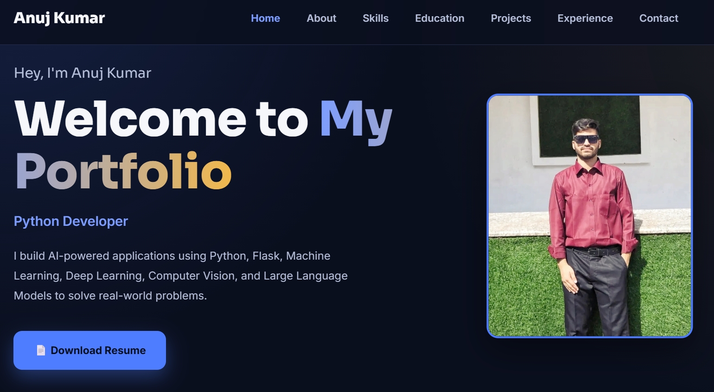
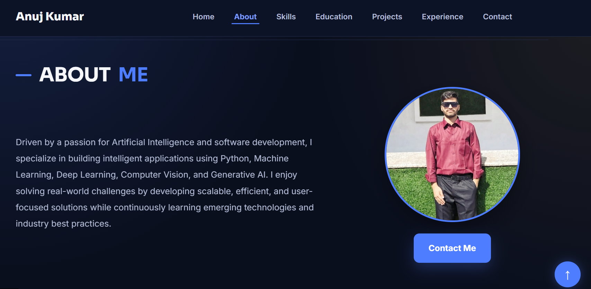
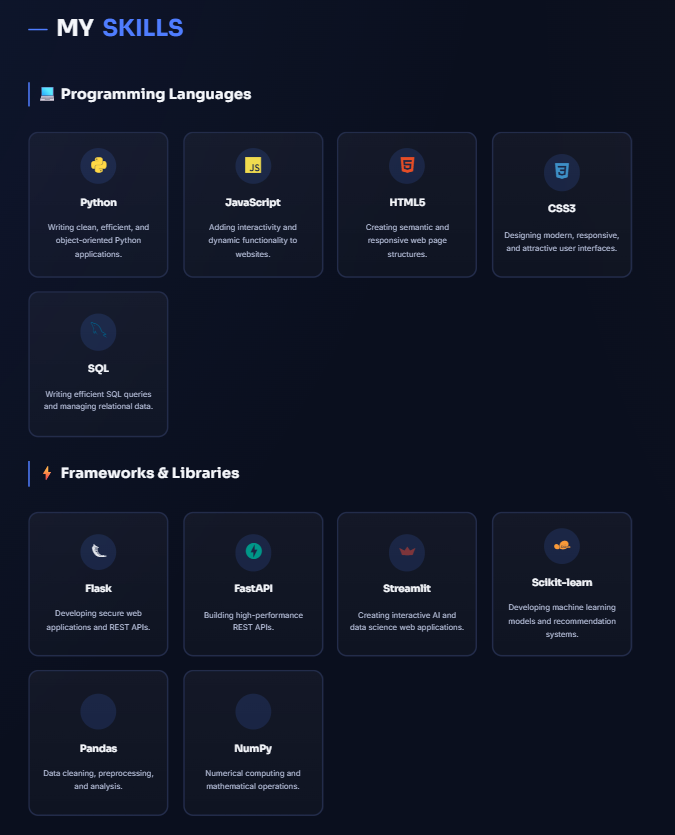
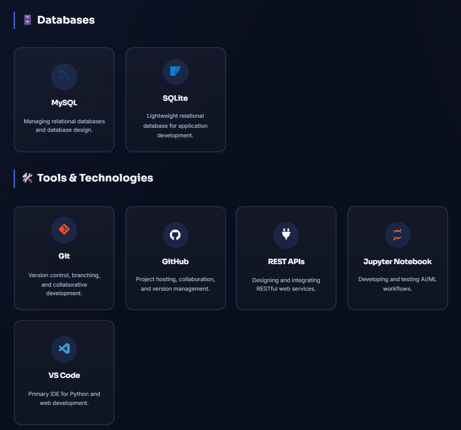
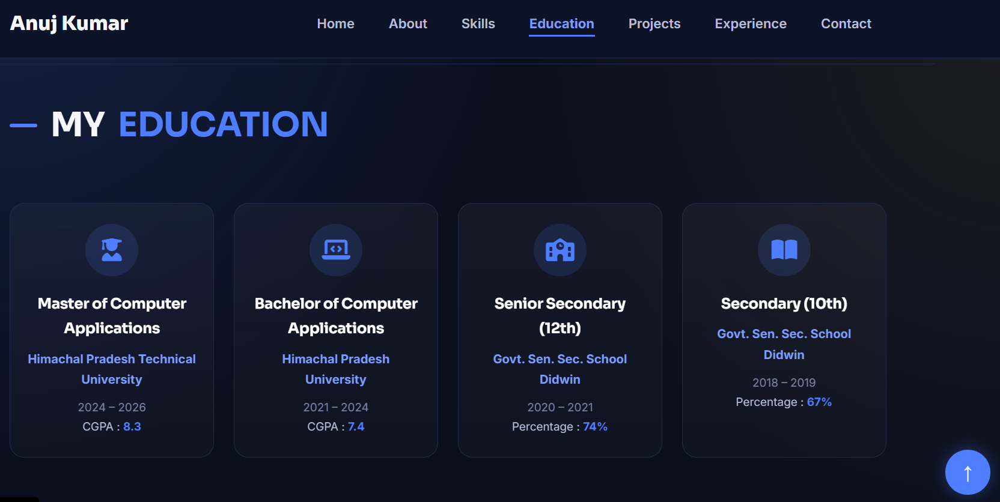
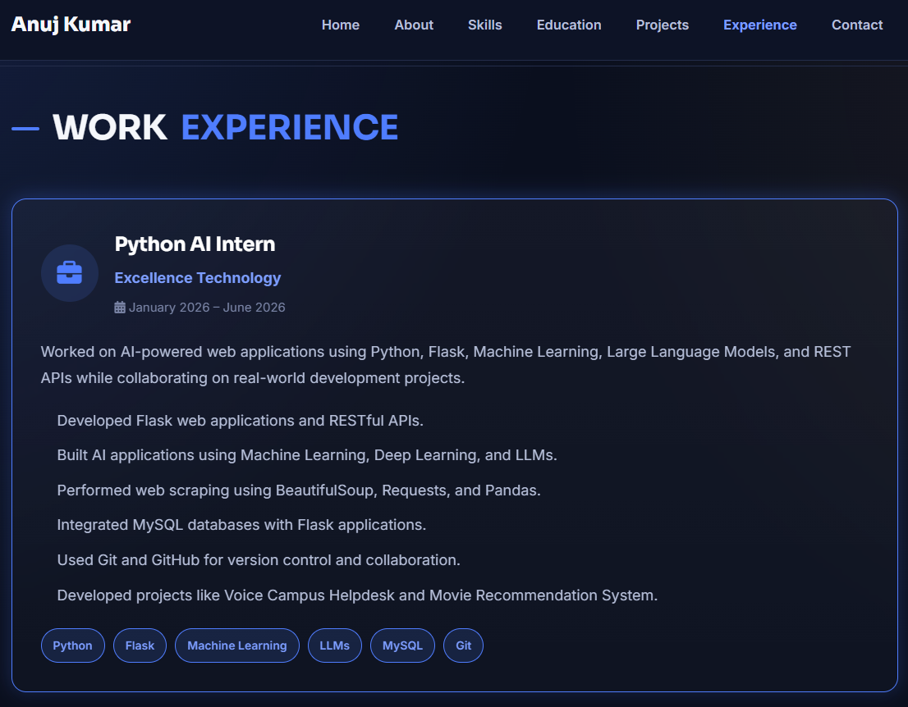
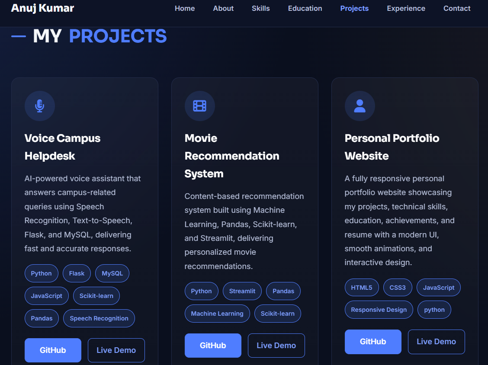
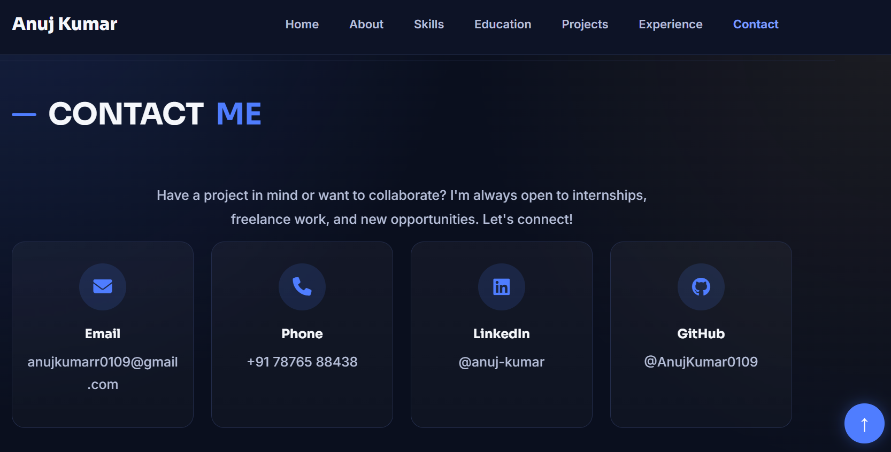

<div align="center">

# 🚀 Anuj Kumar — Portfolio Website

### Python Developer | AI/ML Engineer

A modern, fully responsive portfolio built with **Flask**, showcasing projects, skills, education, and experience through a sleek dark-themed interface with smooth animations and interactive UI.

[](https://www.python.org/)
[](https://flask.palletsprojects.com/)
[](https://developer.mozilla.org/en-US/docs/Web/HTML)
[](https://developer.mozilla.org/en-US/docs/Web/CSS)
[](https://developer.mozilla.org/en-US/docs/Web/JavaScript)
[](#-license)

[🌐 Live Demo](https://portfolio-ten-steel-7c88wqa61u.vercel.app
) • [🐞 Report Bug](#-contact) • [💡 Request Feature](#-contact)

</div>

---

# 📖 Table of Contents

- [About](#-about)
- [Features](#-features)
- [Tech Stack](#️-tech-stack)
- [Project Structure](#-project-structure)
- [Getting Started](#-getting-started)
- [Sections Overview](#-sections-overview)
- [Screenshots](#-screenshots)
- [Featured Projects](#-featured-projects)
- [Responsive Design](#-responsive-design)
- [Roadmap](#-roadmap)
- [Contact](#-contact)
- [License](#-license)

---

# 📌 About

This repository contains the source code for my personal portfolio website developed using **Flask**, **HTML5**, **CSS3**, and **JavaScript**. It showcases my technical skills, projects, education, certifications, experience, and achievements in a clean, responsive, and professional interface.

---

# ✨ Features

- 🎨 Modern and responsive UI
- 📱 Mobile-friendly design
- 🎬 Smooth scrolling animations
- 🍔 Responsive navigation menu
- ⬆️ Back-to-top button
- 📄 Resume download
- 🚀 Project showcase
- 💼 Experience section
- 🎓 Education section
- 📞 Contact section
- 🔍 SEO optimized
- ♿ Accessible design

---

# 🛠️ Tech Stack

| Layer | Technology |
|-------|------------|
| Backend | Python, Flask |
| Frontend | HTML5, CSS3 |
| Interactivity | JavaScript |
| Icons | Font Awesome, Devicon |
| Fonts | Sora, Inter |
| Deployment | Render |

---

# 📁 Project Structure

```text
portfolio/
│
├── app.py
├── requirements.txt
│
├── static/
│   ├── css/
│   ├── js/
│   ├── images/
│   ├── screenshots/
│   │   ├── home.png
│   │   ├── about.png
│   │   ├── skills1.png
│   │   ├── skills2.png
│   │   ├── education.png
│   │   ├── experience.png
│   │   ├── projects.png
│   │   └── contact.png
│   └── resume/
│
└── templates/
    └── index.html
```

---

# 🚀 Getting Started

## Clone Repository

```bash
git clone https://github.com/AnujKumar0109/Portfolio.git
```

## Navigate

```bash
cd Portfolio
```

## Create Virtual Environment

```bash
python -m venv venv
```

Windows

```bash
venv\Scripts\activate
```

Linux / macOS

```bash
source venv/bin/activate
```

## Install Dependencies

```bash
pip install -r requirements.txt
```

## Run

```bash
python app.py
```

Visit:

```
http://127.0.0.1:5000
```

---

# 📄 Sections Overview

| Section | Description |
|---------|-------------|
| Home | Hero section with introduction and resume |
| About | Short introduction |
| Skills | Programming languages, frameworks and tools |
| Education | Academic qualifications |
| Experience | Internship and professional experience |
| Projects | Featured projects |
| Contact | Contact information |

---

# 📸 Screenshots

## 🏠 Home



---

## 👤 About



---

## 🛠️ Skills

### Programming Languages & Frameworks



### Tools & Technologies



---

## 🎓 Education



---

## 💼 Experience



---

## 🚀 Projects



---

## 📞 Contact



---

# 🚀 Featured Projects

| Project | Description | Stack |
|---------|-------------|-------|
| **Voice Campus Helpdesk** | AI-powered voice assistant that answers campus-related queries using Speech Recognition, Text-to-Speech, Flask, and MySQL. | Python, Flask, MySQL, Speech Recognition, Text-to-Speech |
| **Movie Recommendation System** | Content-based recommendation system that delivers personalized movie suggestions using Machine Learning and an interactive Streamlit interface. | Python, Streamlit, Pandas, Scikit-learn, Machine Learning |
| **Personal Portfolio Website** | Fully responsive portfolio website showcasing projects, technical skills, education, certifications, achievements, and resume with a modern interactive interface. | HTML5, CSS3, JavaScript, Flask, Responsive Design |

---

# 📱 Responsive Design

The portfolio uses CSS Grid with:

```css
grid-template-columns: repeat(auto-fit, minmax(220px, 1fr));
```

This automatically adjusts the layout for desktops, tablets, and mobile devices.

---

# 🗺️ Roadmap

- [ ] Dark / Light Theme
- [ ] Blog Section
- [ ] Contact Form Backend
- [ ] Project Filters
- [ ] CI/CD Deployment

---

# 📬 Contact

**Anuj Kumar**

📧 Email: anujkumarr0109@gmail.com

📱 Phone: +91 7876588438

💼 LinkedIn: https://www.linkedin.com/in/anuj-kumar-757725359

💻 GitHub: https://github.com/AnujKumar0109

---

# 📜 License

© 2025 Anuj Kumar. All Rights Reserved.

---

<div align="center">

### ⭐ If you like this project, please consider giving it a star!

</div>
